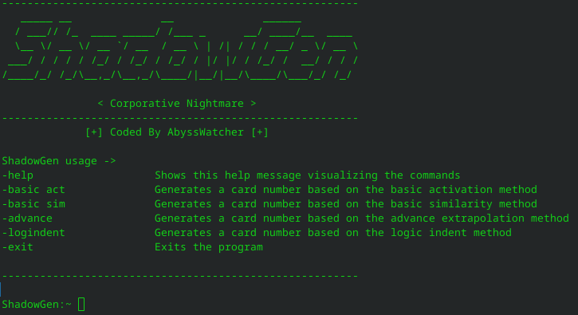

# ShadowGen

## Intro

This credit card extrapolation tool, developed in Python, is essential for conducting audits in a banking context. Designed for both educational purposes and to ensure the integrity and security of credit card transactions, it facilitates the identification and analysis of transaction patterns.

It employs various extrapolation methods and simulates new card numbers, making it an ideal tool for understanding how these methods work and for developing advanced strategies to prevent such activities.

This tool features a command-line interface that allows for fast and intuitive interaction with the program.

The tool is compatible with various Linux distributions, and specific installation scripts are available for:

    Debian-based systems (using apt)
    Fedora (using rpm/dnf)
    Arch-based systems (using pacman)

## Disclaimer for ShadowGen

<b>Purpose:</b> This software, developed by <b>AbyssWatcher</b>, is provided strictly for educational purposes and legitimate auditing activities. It is designed to assist professionals and learners in understanding and enhancing security protocols within banking and financial sectors.

<b>Liability:</b> The creator expressly disclaims any liability for the misuse of this software by any party. Users are solely responsible for ensuring their use of the tool adheres to all applicable laws and ethical standards.

<b>Prohibited Use:</b> The use of this tool for illegal or unauthorized activities is explicitly prohibited. The creator does not endorse, facilitate, nor support the deployment of this software for any illicit purposes.

<b>Legal Consequences:</b> Misuse of this tool can lead to significant legal consequences including criminal penalties. Users must exercise caution and discretion to prevent unauthorized or illegal use.

<b>Compliance:</b> It is the user's responsibility to ensure that their use of <b>ShadowGen</b> complies with all local, state, federal, and international laws. By using this software, users agree to abide by these terms and accept all potential risks and liabilities associated with its use.

## Installation

To install and run the tool, you need to either clone the repository or download the source code. Follow these steps to set up the software on your system:

Clone the repository:

<b>git clone https://github.com/UnknownArtistt/ShadowGen</b>

For Debian-based systems, as an example, make the script executable. Be sure to execute the corresponding script for your distro:

<b>chmod +x shadowgen_debian.sh</b>

Run the installation script:

<b>./shadowgen_debian.sh</b>

This script will install all necessary Python modules and launch the program. Alternatively, after installation, you can run the program either by using the script or directly through Python as needed.
